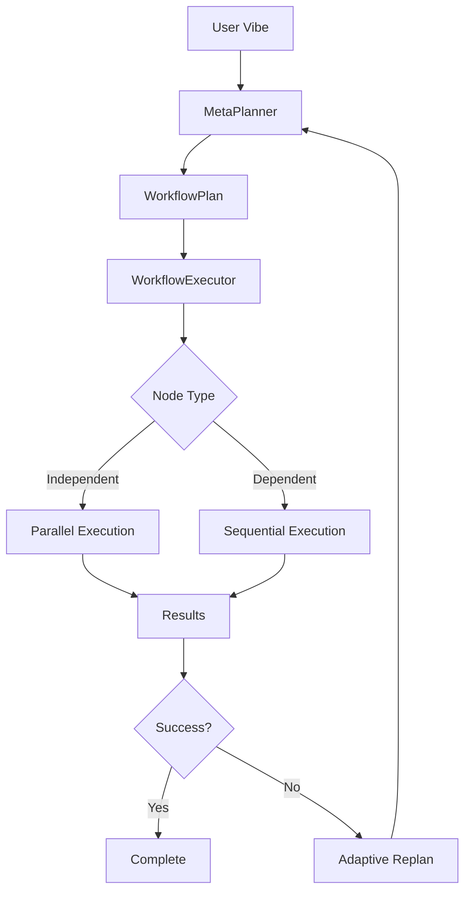

# Core Concepts

Understanding the key concepts behind Vibe AIGC.

## The Intent-Execution Gap

Traditional AI content generation suffers from a fundamental problem: the **Intent-Execution Gap**. Users have complex, multi-dimensional creative visions, but current single-shot models require precise prompt engineering to achieve desired results.

Vibe AIGC addresses this by:

1. **Accepting high-level intent** (Vibes) instead of detailed prompts
2. **Automatically decomposing** intent into executable steps
3. **Adapting dynamically** based on execution feedback

## Vibe

A **Vibe** is a high-level representation of creative intent:

```python
from vibe_aigc import Vibe

vibe = Vibe(
    description="Main creative goal",      # What you want
    style="aesthetic preferences",          # How it should feel
    constraints=["limit1", "limit2"],      # Boundaries
    domain="content type",                  # Context
    metadata={"key": "value"}              # Additional info
)
```

Unlike prompts, Vibes are:

- **Multi-dimensional**: Capture style, constraints, and context
- **Composable**: Can be refined through feedback
- **Abstract**: Don't specify implementation details

## MetaPlanner

The **MetaPlanner** is the central orchestrator that:

1. Receives a Vibe from the user
2. Uses LLM reasoning to decompose it into tasks
3. Generates a hierarchical WorkflowPlan
4. Manages execution and adaptation

```python
from vibe_aigc import MetaPlanner

planner = MetaPlanner()
plan = await planner.plan(vibe)      # Planning only
result = await planner.execute(vibe)  # Plan + execute
```

## WorkflowPlan

A **WorkflowPlan** is the executable decomposition of a Vibe:

```python
from vibe_aigc import WorkflowPlan, WorkflowNode

# Plans contain hierarchical nodes
plan = WorkflowPlan(
    id="plan-001",
    source_vibe=vibe,
    root_nodes=[node1, node2, node3]
)
```

## WorkflowNode

**WorkflowNodes** are individual tasks in the workflow:

```python
from vibe_aigc import WorkflowNode, WorkflowNodeType

node = WorkflowNode(
    id="research",
    type=WorkflowNodeType.ANALYZE,
    description="Research the topic",
    dependencies=["setup"],  # Must complete first
    children=[sub_node1]     # Hierarchical decomposition
)
```

### Node Types

| Type | Purpose |
|------|---------|
| `ANALYZE` | Information gathering and analysis |
| `GENERATE` | Content creation |
| `TRANSFORM` | Modify existing content |
| `VALIDATE` | Quality checks |
| `COMPOSITE` | Groups of related tasks |

## Execution Flow



## Feedback Loops

The system supports multiple feedback mechanisms:

1. **Progress Callbacks**: Real-time execution updates
2. **Adaptive Replanning**: Automatic recovery from failures
3. **Checkpointing**: Save/restore execution state

## Parallel Execution

Independent nodes execute concurrently:

```
     ┌─── Node A ───┐
     │              │
Start├─── Node B ───┼─── End
     │              │
     └─── Node C ───┘
```

Nodes with dependencies wait:

```
Node A ──→ Node B ──→ Node C
          (waits)    (waits)
```

## Next Steps

- [Workflows](workflows.md) - Creating and managing workflows
- [Visualization](visualization.md) - Visualizing execution
- [Checkpoints](checkpoints.md) - Saving and resuming state
