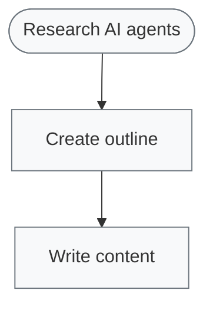

# Visualization

Generate visual representations of workflows.

## ASCII Diagrams

Generate ASCII art diagrams for terminal output:

```python
from vibe_aigc.visualization import WorkflowVisualizer, VisualizationFormat

# Generate ASCII diagram
ascii_diagram = WorkflowVisualizer.generate_diagram(
    plan,
    format=VisualizationFormat.ASCII
)
print(ascii_diagram)
```

Output:
```
Workflow Plan: plan-001
==================================================
Source Vibe: Create a blog post about AI agents

├── ⏳ [analyze] Research AI agents (research)
├── ⏳ [generate] Create outline (outline)
│   └─ Depends on: research
└── ⏳ [generate] Write content (write)
    └─ Depends on: outline
```

## Mermaid Diagrams

Generate Mermaid diagrams for documentation:

```python
mermaid = WorkflowVisualizer.generate_diagram(
    plan,
    format=VisualizationFormat.MERMAID
)
print(mermaid)
```

Output:


## With Execution Status

Pass execution results to show status:

```python
result = await planner.execute(vibe)

# Diagram with status indicators
diagram = WorkflowVisualizer.generate_diagram(
    plan,
    execution_result=result,
    format=VisualizationFormat.ASCII
)
print(diagram)
```

Output:
```
Workflow Plan: plan-001
==================================================
Source Vibe: Create a blog post about AI agents

├── ✅ [analyze] Research AI agents (research)
├── ✅ [generate] Create outline (outline)
│   └─ Depends on: research
└── ❌ [generate] Write content (write)
    └─ Depends on: outline

Execution Summary:
------------------------------
Status: failed
Completed: 2/3
Duration: 5.23s
```

## Status Indicators

| Icon | Status |
|------|--------|
| ⏳ | Pending |
| 🔄 | Running |
| ✅ | Completed |
| ❌ | Failed |
| ⏭️ | Skipped |

## Real-time Visualization

Use `execute_with_visualization` for live updates:

```python
result = await planner.execute_with_visualization(vibe)
# Prints diagram with live status updates
```

## Embedding in Documentation

For Markdown/HTML docs, use Mermaid:

```python
mermaid = WorkflowVisualizer.generate_diagram(
    plan, 
    format=VisualizationFormat.MERMAID
)

# Write to markdown file
with open("workflow.md", "w") as f:
    f.write("```mermaid\n")
    f.write(mermaid)
    f.write("\n```")
```
